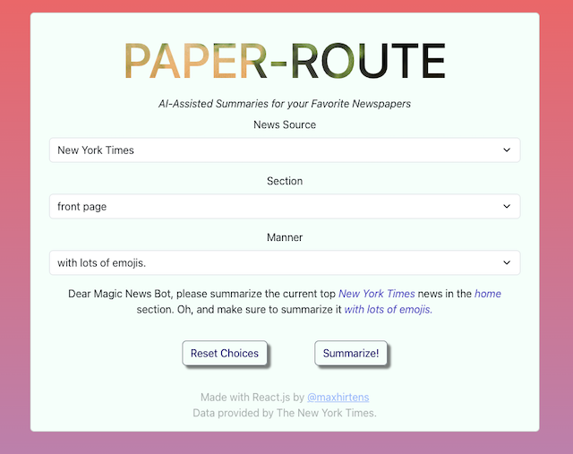
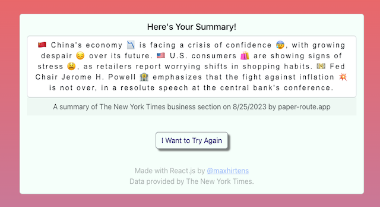

# Paper Route

> AI-Assisted Summaries for the News...

Available at [paper-route.app](www.paper-route.app)

## What is Paper Route?

Paper Route is a site that uses AI language models to summarize today's top news from the New York Times (and eventually other newspaper sources.) You can choose to receive a summary of the following news sections: arts, business, politics, technology, sports, world, or simply the current front page.
Several different personas are available to use. For example, you can select "summarize today's politics news as Shakespeare", or "summarize the front page for a second-grader".

An example summary for "the business section with lots of emojis":

## Stack

Frontend: React, CSS, HTML.
Backend: Node.
Database: PostgresQL.

## Testing

'npm test' in either backend or frontend directories to run all available tests.

## APIs Used

New York Times: https://api.nytimes.com/

ChatGPT: https://platform.openai.com/

